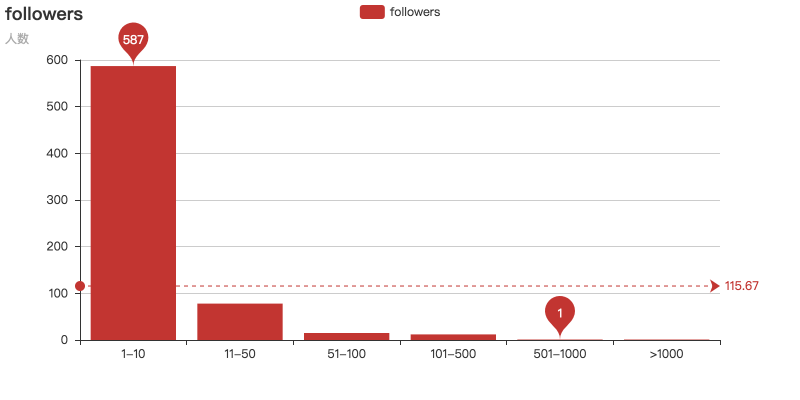
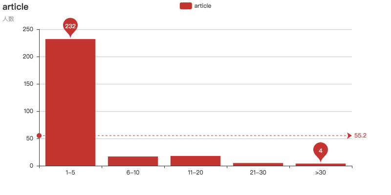
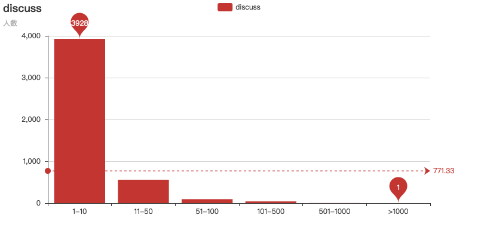
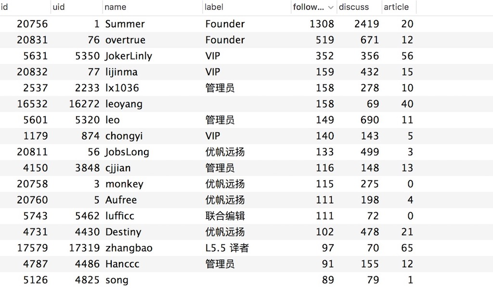

# laravel-china用户分析

想要了解laravel-china.org上的大牛都有哪些？

业余时间使用python爬取了[laravel-china.org](http://www.laravel-china.org)上的所有用户信息，可以很直观的看到上面的大牛，之后进入https://laravel-china.org/users/ + 用户id，你就可以看到大牛的主页了


爬虫设置的sleep时间，考虑了对网站的压力，所以速度会比较慢。

## Feature
- requests包进行http请求
- 使用pandas分析数据
- pyecharts生成图表，十分方便

## 建表sql

```mysql
CREATE TABLE `laravel_china_users` (
  `id` int(11) unsigned NOT NULL AUTO_INCREMENT,
  `uid` int(11) NOT NULL COMMENT '用户id',
  `name` varchar(50) NOT NULL DEFAULT '' COMMENT '昵称',
  `label` varchar(50) NOT NULL DEFAULT '' COMMENT '标签',
  `followers` int(11) NOT NULL COMMENT '关注者',
  `discuss` int(11) NOT NULL COMMENT '讨论数',
  `article` int(11) NOT NULL COMMENT '文章',
  PRIMARY KEY (`id`)
) ENGINE=InnoDB DEFAULT CHARSET=utf8;
```


## Quick Start

```python
1. 执行建表语句
2. 修改common.py的数据库连接
3. 执行python3 users.py 

#生成统计表
python3 analysis.py 
```


## 结果分析

### follow数量分析



### article数量分析


### discuss数量分析


### 数据库
还是summer大神牛啊



Over